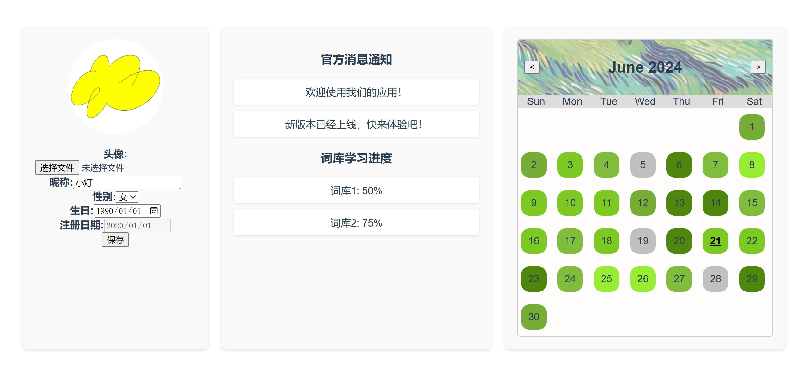
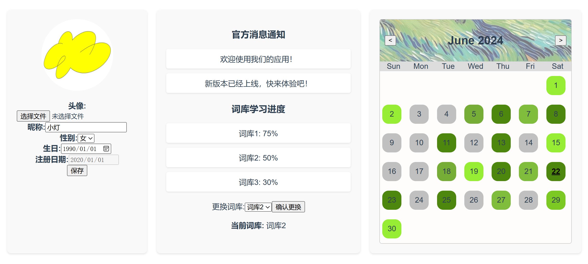
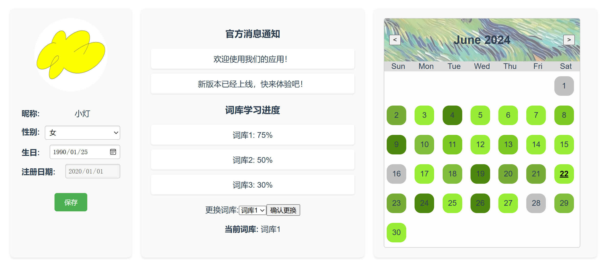
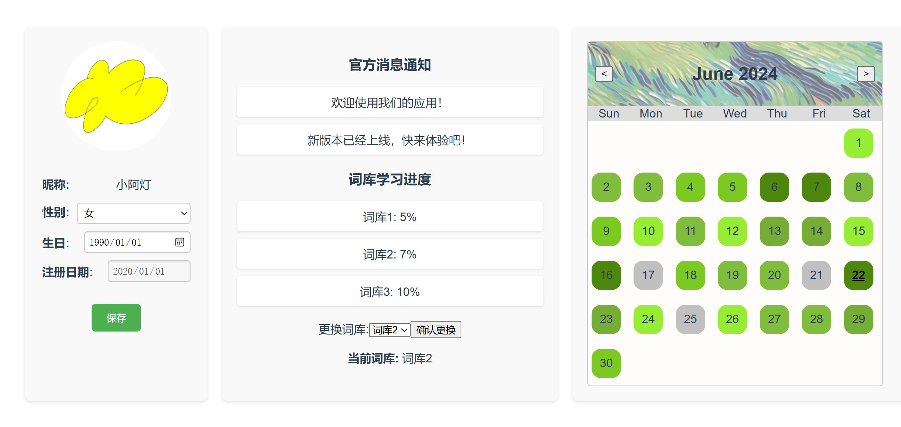
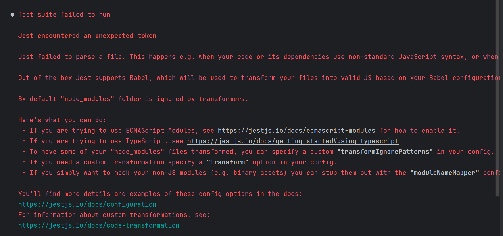
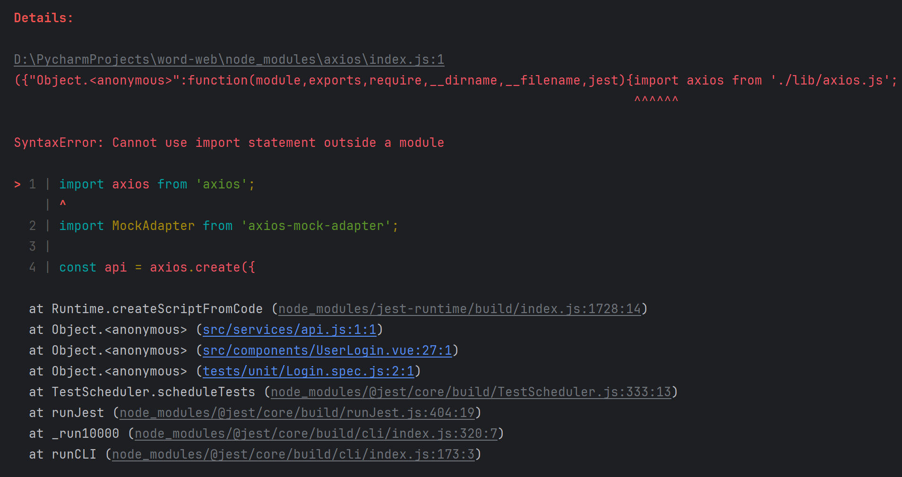

## 登录界面
 

## 注册界面
点击【注册】，跳转到注册界面

1. 要求要填完四栏才允许注册  
2. 会有电子邮件的格式检测`@`   
3. 有密码和确认密码的匹配确认  

> 可以继续完善： 
> 1. 其他注册方式
> 2. 用户名要求唯一吗
> 3. 密码长度、强度有要求吗 

## 表单验证

1. 手动添加验证条件  
1.1 不能为空  
1.2 电子邮件的格式: `'...'@'...'.'...'`  
1.3 密码长度有要求，目前设置为6位以上  
2. 错误显示为红色

## 完善+验证
### 登录
从【**用户名** + **密码**】改为【**邮箱**+**密码**】
登录测试，只有当：  
邮箱：test@a.com  
密码：test.com  
才能登录成功，跳转到主界面  
否则出错：


### 注册
如果邮箱已经被注册过，则注册失败：  


## 个人中心
大概长这样

> 还差：
> 1. 用户可以更改昵称、头像等信息
> 2. 其他的，再说吧。。。。
### 修改个人信息
个人信息 丑丑的  
> 还差：
> 1. 美化一下子
> 2. 模拟测试


### 修改词库


### 个人信息 美化
鼠标点击头像/昵称，就可以修改


### 登录后跳转到个人中心，请求后端，mock模拟


# 测试
```
npm install @vue/test-utils --save-dev
vue add @vue/cli-plugin-unit-jest
```
运行不成功，报错：

试过各种babel配置、"type":"module" 都没有解决
最终通过配置jest："transformIgnorePatterns": ['node_modules/(?!(axios)/)'] 成功解决
